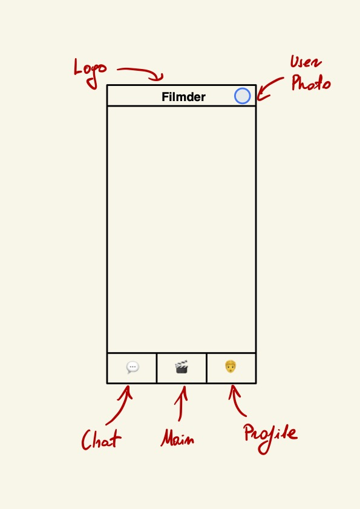
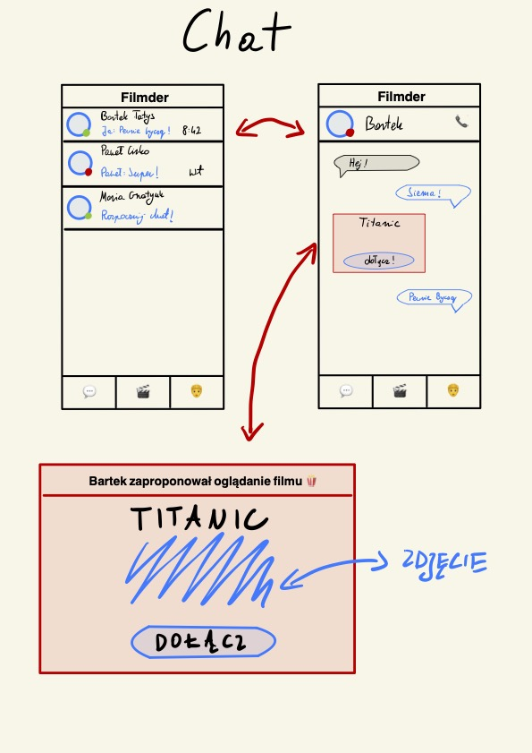
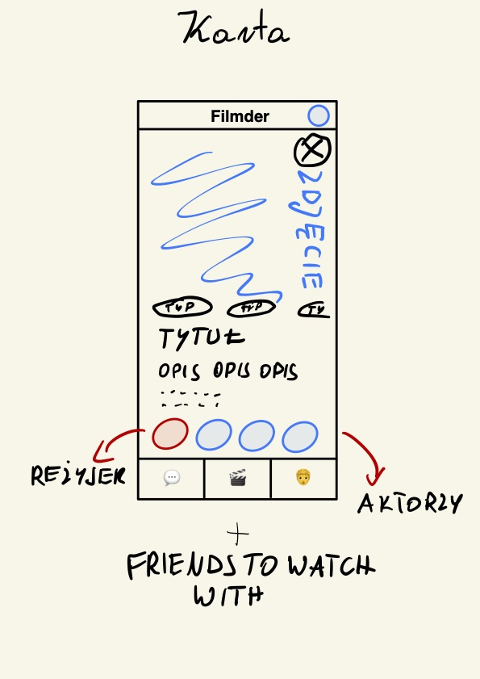
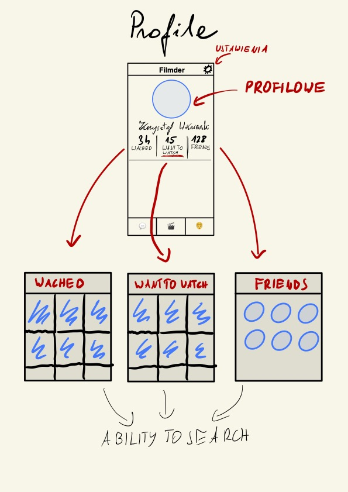
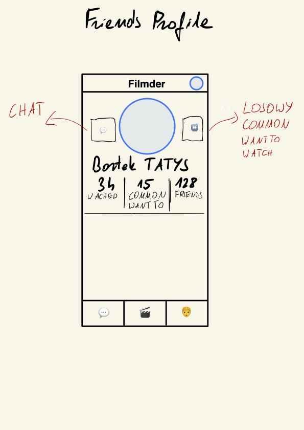

# Software Requirements Specification for Filmder

## Introduction
1. <b>Purpose</b> 
    

    This document represent the Software Requirements Specification (SRS) for the FilmderAPP. It is designed and written primarily for the developers involved in this project. It's purpose is to describe the scope, both functional and non-functional requirements, as well as the design constraints of the project. Furthermore, this project shows how the system's interfaces are designed in detail. [1]
    

2. <b>Scope</b> 
    

    The FilmderApp is a mobile app that cater the needs and desires of movie enthusiasts, offering a comprehensive solution for tracking, discovering and recommending films.

    The primary purpose of Filmder is to empower users with the ability to discover films tailored to their individual tastes and preferences. Moreover, the app promotes social interactions and engagement by allowing users to connect with each other to find films in their common niche.

    It is vital to add, that the app itself will not contain streaming service for films - however short trailers may be added in the future.

    Above all, we ought to create a place for film aficionados, where they can expand their cinematic horizons. 
    

3. <b>Definitions, acronyms</b> 

    | Definition | Explanation                         |
    |------------|-------------------------------------|
    | Def1       | Exp1                                |

    | Acronym | Explanation                         |
    |---------|-------------------------------------|
    | FD      | FilmderApp                          |
    | GH      | GitHub                              |
    | SRS     | Software Requirements Specification |
    | DB      | DataBase                            |
    | DBMS    | DataBase Management System          |
    | RN      | ReactNative                         |

4. <b>Reference documents</b> 
    * GH link: https://github.com/KaWis17/Filmder
    * Jira link: https://kapelakapelki.atlassian.net/jira/software/projects/SCRUM/boards/1

5. <b>Overview</b>  
    Members of a team:
    1. Maria Gnatyuk
    2. Bartosz Tatys 
    3. Paweł Cirko
    4. Jan Poręba
    5. Krzysztof Wiśniewski

    

    Next part of the SRS will focus on overall description of our programming endeavor, but also on a more specific requirements for different part of the system. 
    

## General description
1. <b>Product perspective</b>  
    * Cross platform support: Offers operating support for all operating systems.
    * Large database of films (including a short decsription and a link to a trailer).
    * User account: The system allows the user to create their accounts in the system and provide features of updating and viewing profiles.
    * Number of users being supported by the system: Though the number is precisely not mentioned but the system is able to support a large number of online users at the same time.
    * People search: search is simply local search engine based on key words.
    * Comment section for every film: provides users with a platform to discuss this particulat film.
    * Comunication between profiles: allows user to privately communicate between each other.
    * Generating film preferences for every user by analyzing users previous choices.
    * Matching people with similar film preferences.
    * Creating rankingS of films due to some criterias.
2. <b>User characteristics</b>  
    

    The primary user of FD is a movie enthusiast. This group consists of people who vary in background and move preference. However, the common factor is that they are in most cases 'tech-savvy' and quickly adapt to new user interfaces. It is vital to provide them with high-quality and accurate predictions about their movie taste. As the primary target is the young generation, they will highly appreciate seamless user experience and social futures to connect to other like-minded individuals.
    The administrator is expected to be familiar with the interface of the tech support system.
    

3. <b>Constraints</b>  
    * OS constraint - an app must be compatible with iOS 16 and Android 12 versions.
    * Network constraint - an app must function both on Wi-Fi networks and Mobile Data. It should handle occasional network disruptions.
    * Legal compliance - user data should be protected by standards required by the EU regulations.
    * Platform constraints - an app should contain all requirements to deploy it on AppStore and PlayStore.
    * Performance constraint - an app must load within 5 seconds on a middle-tier phones.
    * Integration constraint - an app should support user authentication via Google OAuth.
    * Framework constraint - an app must be compatible with third-party libraries licensing requirements.
    * Scalable constraint - an app will be designed to support future scaling 
4. Assumptions and Dependencies
    

    Performance of FD highly depends on the internet quality of user. Also some differences could appear due to different operation systems.
    

    
## Specific requirements 
1. External interface requirements
    * User interfaces
    * Hardware interfaces
    * Software interfaces 
    * Communication interfaces
2. Functional requirements
    * Enable a user to create a profile.
    * Enable a logged in user to ask update his profile which includes his location, film preferences, subscriptions and profile picture.
    * Enable a logged in user to swipe films.
    * Enable a logged in user to check films information.
    * Enable a logged in user to write comments in a comment section, reply for other comments, delete users comments.
    * Enable a logged in user to communicate with other users, add users to friend list and block users.
    * Enable a logged in user to suggest changes in FD.
    * Enable a logged in user to suggest extending film database with a selected film.
    * Enable the admin to view users suggestions, add films to database, direct some suggestions to developers.
3. <b>Performance requirements</b>  
    * Performance - The system must be interactive and the delays involved must be less.
    * Safety - Information transmission should be securely transmitted to server without any changes in information.
    * Reliability - Users can access their profile 98% of the time without failure.
4. Design constraints
    * Standards compliance
    * Hardware limitations
5. Software system attributes
    * Availability - If the internet service gets disrupted while sending information to the server, the information can be send again for verification.
    * Security - The main security concern is for users account hence proper login mechanism should be used to avoid hacking. 
    * Maintainability - Sending user suggestions to admins allows FD to be up-to-date.
    * Portability - As the system uses unique profiles for every user, remembering login and password is enough to reach user account on enother device.
    * Usability - As the system is easy to handle and navigates in the most expected way with no delays. 
6. Other requirements

## Businnes Logic Elements
Matching films to user 

The first part of movie proposal is to decide whether to pick title based on user preferences or something based on recent trends. This decision is being taken randomly with given probabilities. Option based on trends means picking one of the movies in top of leaderboard independently form user's taste. It prevents the overfitting of the model. The other option picks movie genre based on score system. 

Genre score system: 

Score system is being determined on the onboarding operation explained below and user's responses to previous proposals. All film categories receive a certain weight, which should reflect the user's interest in this category (proposed weights: 1, 2, 3). Then, a film category is drawn, and the probability of drawing a given category is equal to the category weight divided by the sum of the weights of all categories.  

The weights may change depending on the user's likes. When a user likes 3 videos in a row from a given category, the weight of that category increases by 1 (if it was not the maximum weight). Similarly, when a user dislikes three videos in a row from a given category, the weight decreases by 1 (if it was not the minimum weight).  

This score system allows to adapt to the user's preferences in a short time. A user can change the frequency of a given category after just 3 movies, even if they had a bad attitude towards such films before. 

After selecting a category, the algorithm selects a movie (to be determined whether it is completely random, the newest, etc.) 

Initial Preference Learning: 

After creation of account, user is being given a certain amount of film suggestions. Suggestions are picked randomly, but there is a maximum number of suggestions with the given genre of motion picture. In this stage the number of points (positive or negative) given to genre if user likes/dislikes film of this genre is increased to make algorithm learn users tastes faster.  

This “onboarding” sequence serves also as a walkthrough which explains how to use the application. First few films suggestions are displayed with additional popups containing explanation of how users interface works. 

## Appendices

### Revision history

| Date      | Author               | Version | Change reference            |
|-----------|----------------------|---------|-----------------------------|
| 20 X 2023 | Krzysztof Wiśniewski | 0.1     | SRS structure |
| 20 X 2023 | Krzysztof Wiśniewski | 0.2     | Purpose, Scope, Acronyms, References, Overview |
| 20 X 2023 | Krzysztof Wiśniewski | 0.3     | Drafts |
| 22 X 2023 | Krzysztof Wiśniewski | 0.4     | Demo |
| 22 X 2023 | Krzysztof Wiśniewski | 0.5     | Constraints, User Characteristics |
| 23 X 2023 | Mariia    Hnatiuk    | 0.6     | Functional / Non functional requirements |
| 24 X 2023 | Bartosz Tatys        | 0.7     | Businnes Logic Elements |

### Drafts 

## Index
[1] https://se.inf.ethz.ch/courses/2011a_spring/soft_arch/exercises/02/Requirements_Specification.pdf

